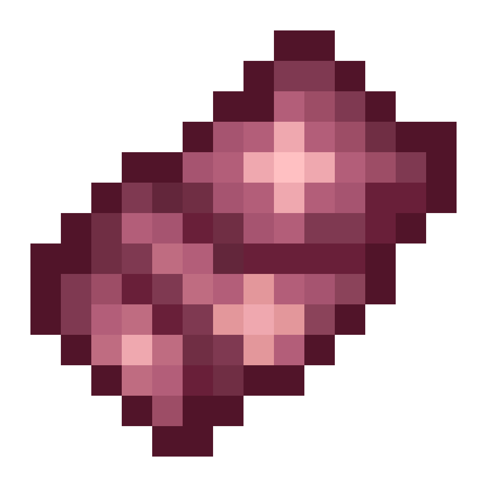
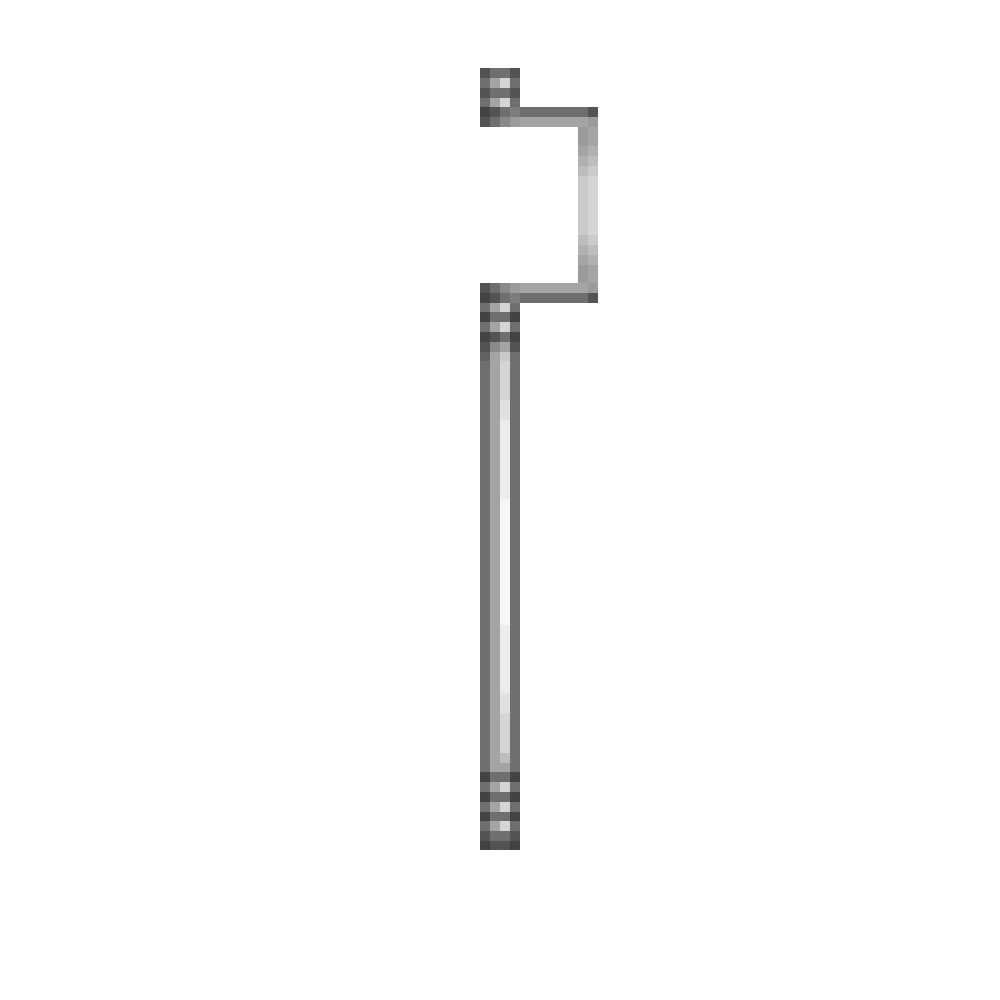
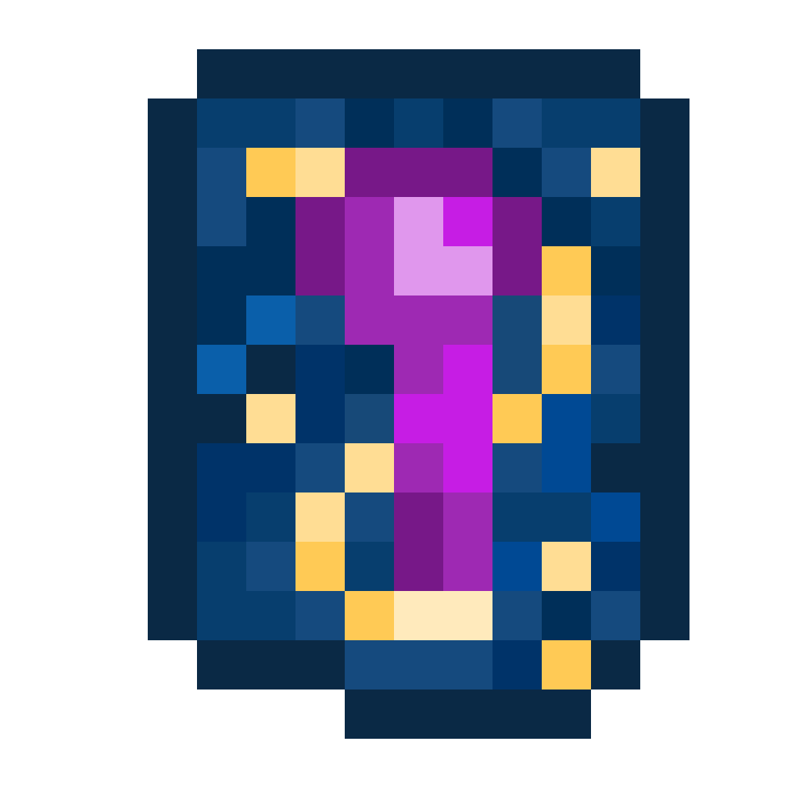

# Staff Mod Items

## Faint staff rod

**Faint staff rod** is a [common](https://minecraft.wiki/w/Rarity#Tiers) item used to craft staffs.

??? render "Renders"
    
    *Faint staff rod item*{.center}
    
    *Faint staff rod 3D render*{.center}

### Crafting

[{.x32}](https://minecraft.wiki/w/End_Rod "End Rod")  
[{.x32}](https://minecraft.wiki/w/Blaze_Rod "Blaze Rod") :material-arrow-right:{.x32} {.x32}  
[{.x32}](https://minecraft.wiki/w/Breeze_Rod "Breeze Rod")

## Faint royal staff head

**Faint royal staff head** is a [rare](https://minecraft.wiki/w/Rarity#Tiers) item used to craft **[Faint royal staff](#faint-royal-staff)**.

??? render "Renders"
    
    *Faint royal staff head item*{.center}
    
    *Faint royal staff head 3D render*{.center}

### Crafting

[{.x32}](#royal-staff-ingredient "Royal staff ingredient")
[{.x32}](#royal-staff-ingredient "Royal staff ingredient")  
[{.x32}](https://minecraft.wiki/w/Nether_Star "Nether Star")
[{.x32}](#royal-staff-ingredient "Royal staff ingredient") :material-arrow-right:{.x32} {.x32}  
[{.x32}](#royal-staff-ingredient "Royal staff ingredient")
[{.x32}](#royal-staff-ingredient "Royal staff ingredient")  

## Faint royal staff

**Faint royal staff** is a [rare](https://minecraft.wiki/w/Rarity#Tiers) item, which can be transform it to a **[Royal staff](#royal-staff)**.

??? render "Renders"
    
    *Faint royal staff item in inventory*{.center}
    
    *Faint royal staff side view*{.center}
    
    *Faint royal staff 3D render*{.center}

### Crafting

[{.x32}](#faint-royal-staff-head "Faint royal staff head")  
[{.x32}](#faint-staff-rod "Faint staff rod") :material-arrow-right:{.x32} {.x32}  
[{.x32}](#faint-staff-rod "Faint staff rod")  

## Royal staff

**Royal staff** is an [epic](https://minecraft.wiki/w/Rarity#Tiers) item, which is heavily inspired by [King Orange](https://animatorvsanimation.fandom.com/wiki/King_Orange)'s [Perfected staff](https://animatorvsanimation.fandom.com/wiki/Staffs#Perfected_staff). However, the model and its texture is not fully canonically accurate for practical, aesthetic, and balanced survival gameplay reasons.

??? render "Renders"
    
    *Royal staff item in inventory*{.center}
    
    *Royal staff side view*{.center}
    
    *Royal staff 3D render*{.center}
    
    *Steve holds an empty Royal staff*{.center}
    
    *Steve holds forwards an empty Royal staff*{.center}

### Smithing

[{.x32}](#staff-infusion-smithing-template "Staff infusion smithing template")
[{.x32}](#faint-royal-staff "Faint royal staff")
[{.x32}](https://minecraft.wiki/w/Redstone_Dust "Redstone Dust")
:material-arrow-right:{.x32}
{.x32}

### Insert an item into the staff

1. Put the staff in one of your hands
2. Put an item in your other hand
3. Press `R` (default keybind, can be changed in Minecraft settings)

### Remove an item from the staff

1. Put the staff in one of your hands
2. Make sure your other hand has space for the item in the staff
3. Press `R` (default keybind, can be changed in Minecraft settings)

## Royal staff ingredient

**Royal staff ingredient** is a [common](https://minecraft.wiki/w/Rarity#Tiers) item used to craft **[Faint royal staff head](#faint-royal-staff-head)**.

??? render "Renders"
    
    *Royal staff ingredient item*{.center}

### Crafting

[{.x32}](https://minecraft.wiki/w/Iron_Ingot "Iron Ingot")
[{.x32}](https://minecraft.wiki/w/Echo_Shard "Echo Shard")
[{.x32}](https://minecraft.wiki/w/Iron_Ingot "Iron Ingot")  
[{.x32}](https://minecraft.wiki/w/Copper_Ingot "Copper Ingot")
[{.x32}](#crown-of-king-orange "Crown of King Orange")
[{.x32}](https://minecraft.wiki/w/Copper_Ingot "Copper Ingot") :material-arrow-right:{.x32} {.x32}  
[{.x32}](https://minecraft.wiki/w/Iron_Ingot "Iron Ingot")
[{.x32}](https://minecraft.wiki/w/Netherite_Ingot "Netherite Ingot")
[{.x32}](https://minecraft.wiki/w/Iron_Ingot "Iron Ingot")  

## Crown of King Orange

**Crown of King Orange** is an [uncommon](https://minecraft.wiki/w/Rarity#Tiers) item used to craft [**Royal staff ingredient**](#royal-staff-ingredient). [Piglins](https://minecraft.wiki/w/Piglin) become neutral towards the wearer of the crown, but not [Piglin Brutes](https://minecraft.wiki/w/Piglin_Brute), just like wearing gold armor.

??? render "Renders"
    
    *Crown of King Orange item*{.center}
    
    *Steve wearing Crown of King Orange*{.center}

### Obtaining

**Crown of King Orange** has 100% change of generating in the [treasure room](https://minecraft.wiki/w/Bastion_Remnant#Treasure_room) of a [Bastion Remnant](https://minecraft.wiki/w/Bastion_Remnant). [See related loot table](data.md#avm_staffloot_tablesadd_loot_poolchestsbastion_treasurejson).

### Placing

Crown of King Orange can be placed on the floor or walls as decoration, similar to a [skull](https://minecraft.wiki/w/Skull) block.

## Staff infusion smithing template

**Staff infusion smithing template** is a [common](https://minecraft.wiki/w/Rarity#Tiers) item used to infuse a material into a faint staff, transforming it into a functioning staff.

??? render "Renders"
    
    *Staff infusion smithing template item*{.center}

### Obtaining

**Staff infusion smithing template** can be found in standard [vaults](https://minecraft.wiki/w/Vault) in [trial chambers](https://minecraft.wiki/w/Trial_chambers). If the vault has [unique loot](https://minecraft.wiki/w/Vault#Loot), there's a 1 in 6 chance that it drops a **Staff infusion smithing template**. [See related loot table](data.md#avm_staffloot_tablesadd_loot_poolcheststrial_chambersreward_uniquejson).

### Duplicating

[{.x32}](https://minecraft.wiki/w/Diamond "Diamond")
[{.x32}](#staff-infusion-smithing-template "Staff infusion smithing template")
[{.x32}](https://minecraft.wiki/w/Diamond "Diamond")  
[{.x32}](https://minecraft.wiki/w/Diamond "Diamond")
[{.x32}](https://minecraft.wiki/w/Block_of_Lapis_Lazuli "Block of Lapis Lazuli")
[{.x32}](https://minecraft.wiki/w/Diamond "Diamond") :material-arrow-right:{.x32} {.x32}×2  
[{.x32}](https://minecraft.wiki/w/Diamond "Diamond")
[{.x32}](https://minecraft.wiki/w/Diamond "Diamond")
[{.x32}](https://minecraft.wiki/w/Diamond "Diamond")
